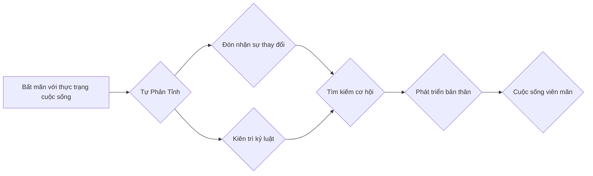

```mermaid
graph LR
A[Bất mãn với thực trạng cuộc sống] --> B{Tự Phản Tỉnh}
B --> C{Đón nhận sự thay đổi}
B --> D{Kiên trì kỷ luật}
C --> E{Tìm kiếm cơ hội}
D --> E
E --> F{Phát triển bản thân}
F --> G{Cuộc sống viên mãn}
```
```mermaid
graph LR
A[Mắc kẹt trong tư duy vật chất] --> B{Buông bỏ vật chất}
B --> C{Tự lực}
A --> D{Buông bỏ gánh nặng cảm xúc}
D --> C
C --> E{Tự do thực sự}
